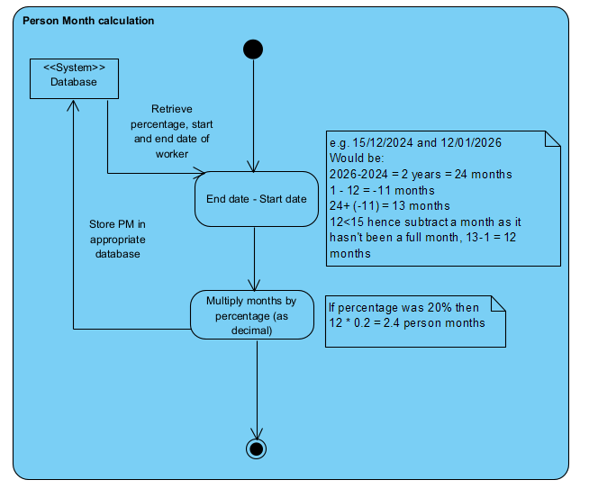

# Person Months

This diagram shows how we will be calcuating person months (PM). 

We retrieve the start date, end date, and percentage of the worker from the database and calcuate how many full months they worked or will work.

We then multiply those months by the percentage, the result is the PM of that worker.

We store the PM in the appropriate database.

Methods to calculate months and final PM are shown in the diagram.

