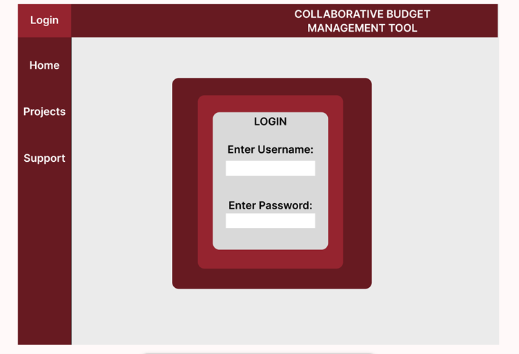
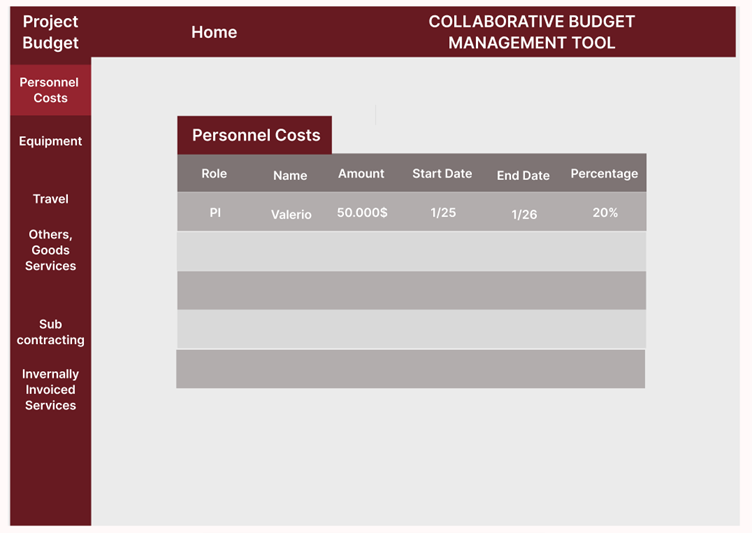
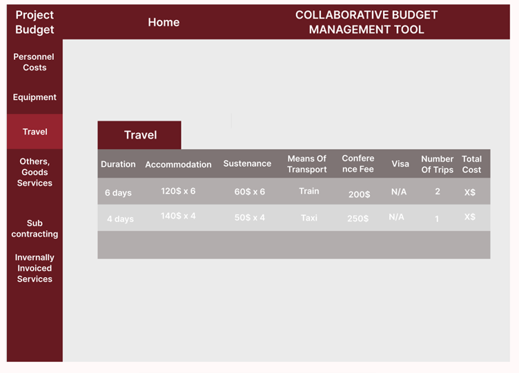

# low fidelity prototype

This prototype is used to give us an idea of how the dashboard of the webapp should look like to make the design process easier.

Initial page for website, ability to log in to your account (enter username and password) 

After logging in, able to access: 

Home page: will include your information 
Projects page: projects you are involved it 
Support page 

We have entered the project page, clicked on the specific project and we are given this page with the project’s breakdown 

Currently we are on the Personnel costs Page 

We are given the table with the Personnel costs breakdown 

It includes: 
The role of the User 
His name 
The Amount he is being paid 
The start and end date he is working 
Percentage shows the percentage of the budget the specific person is being paid 

Here similarly to the Personnel Costs page we have selected the Travel option in our project 

We have the breakdown of the Travel costs 
Duration displays the amount of days this conference trip took 
Accommodation is the amount paid for accommodation 
Sustenance includes costs for things such as food 
Means of Transport will be able to become a dropdown so the user is able to include all methods of transport he used on the trip and how much they cost him  
Conference fee is the fee for the conference the user attended  
Number of trips 
Total costs calculates the total costs for the trip 

