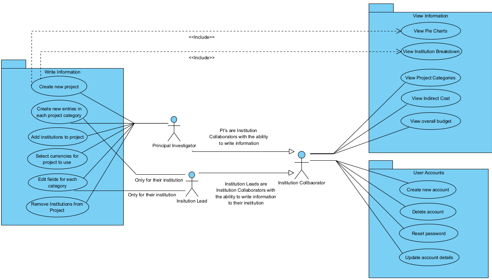

# Use Case Diagram

This use case diagram shows the different use cases of the system which were analysed during the first supervisor meeting.

The 3 actors and their uses of the system are shown from the stakeholder analysis, including:

- Principal Investigator
- Institution Lead
- Institution Collaborator

---

---

### Use Cases to User Story Mapping

This table maps each use case witht the user story that it is accomplishing.

| Use Case Name                               | User Story ID |
| ------------------------------------------- | ------------- |
| Create new account                          |               |
| Delete account                              |               |
| Reset password                              |               |
| Update account details                      |               |
| View project categories                     |               |
| View indirect cost                          |               |
| View overall budget                         |               |
| Create new project                          |               |
| Create new entries in each project category |               |
| Add institutions to project                 |               |
| Select currencies for project to use        |               |
| Edit fields for each category               |               |
| Remove institutions from project            |               |
| View pie charts                             |               |
| View institution breakdown                  |               |
